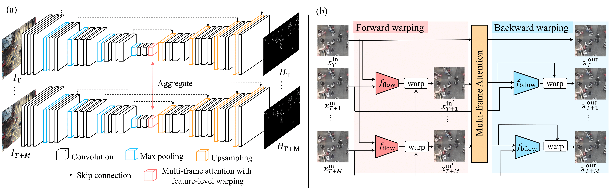

# Multi-Frame Attention with Feature-Level Warping for Drone Crowd Tracking

## Overview of our method

> Overview of our method. (a) Entire network structure, (b) Multi-frame attention with feature-level warping. The module consists of three modules: forward warping, multi-frame attention, and backward warping. Forward warping aligns features according to frame $T$, and multi-frame attention aggregate temporal context. Since the extracted feature maps are aligned to $T$, the feature maps are warped into features that represent original positions by backward warping.

This repository provides the offical release of the code package for my paper Multi-Frame Attention with Feature-Level Warping for Drone Crowd Tracking in WACV 2022 (url comming soon). 

This method is designed to better address the problem of drone crowd tracking by efficiently aggregating multiple frames information. Comparing to conventional seven methods, proposed method improves the tracking and localization mAP from backbone score. 

## Requirements
* PyTorch 1.12.0
* cuda && cudnn
* Download the DroneCrowd datasets
  DroneCrowd [BaiduYun](https://pan.baidu.com/s/1hjXoVZJ16y9Tf7UXcJw3oQ)(code:ml1u)| [GoogleDrive](https://drive.google.com/drive/folders/1EUKLJ1WmrhWTNGt4wFLyHRfspJAt56WN?usp=sharing) 

We strongly recommend using a virtual environment like Anaconda or Docker.
The following is how to build the virtual environment for this code using anaconda.
```
$ pip install -r env/requirements.py
```


## Dataset
### DroneCrowd (Full Version)
This full version consists of 112 video clips with 33,600 high resolution frames (i.e., 1920x1080) captured in 70 different scenarios.  With intensive amount of effort, our dataset provides 20,800 people trajectories with 4.8 million head annotations and several video-level attributes in sequences.  

DroneCrowd [BaiduYun](https://pan.baidu.com/s/1hjXoVZJ16y9Tf7UXcJw3oQ)(code:ml1u)| [GoogleDrive](https://drive.google.com/drive/folders/1EUKLJ1WmrhWTNGt4wFLyHRfspJAt56WN?usp=sharing) 

### Preparation
Please prepare your data you installed as above as follows.

<details><summary>current dir</summary><div>

```
./dataset
    ├── train
    │   └── train_imgs                       
    │        ├── sequence001                # Each sequence has 300 images 
    │        ├── sequence002
    │        ├── :
    │        └── sequenceN                       
    ├── val  
    │   └─ val_imgs                          # Same structure of train_imgs
    │        ├── sequence011                # Each sequence has 12 images 
    │        ├── sequence015
    │        ├── :
    │        └── sequenceM  
    └── test
         └── test_imgs                       # Same structure of train_imgs.
              ├── sequence011                # Each sequence has 300 images 
              ├── sequence015
              ├── :
              └── sequenceM  
```
</div></details>


### Ground-Truth
If you use this code, run this command to create heatmap's ground-truth first.
Training & Validation ground-truth are added in dataset directory.
The train_map and val_map directory will be automatically created.
```
$ python create_gts.py
```

## Training
1. Prepare the training set. In dataset directory(example datsets are setted). Default dataset's path is determined at  <code>config/train.yaml</code>.
2. Run the training script	
```
$ python train.py
```

### Arguments
You can set up input path/output path/parameters from <code>config/train.yaml</code>.

## Test
Comming soon
### Pre-trained models	
The trained models are available in the folder <code>/models/trained</code>.

## Citation
Please cite this paper if you want to use it in your work.
```
@inproceedings{dronecrowd_cvpr2021,
  author    = {Longyin Wen and
               Dawei Du and
               Pengfei Zhu and
               Qinghua Hu and
               Qilong Wang and
               Liefeng Bo and
               Siwei Lyu},
  title     = {Detection, Tracking, and Counting Meets Drones in Crowds: A Benchmark},
  booktitle = {CVPR},
  year      = {2021}
}
```
```
@article{zhu2021graph,
  title={Graph Regularized Flow Attention Network for Video Animal Counting from Drones},
  author={Zhu, Pengfei and Peng, Tao and Du, Dawei and Yu, Hongtao and Zhang, Libo and Hu, Qinghua},
  journal={IEEE Transactions on Image Processing},
  year={2021},
  publisher={IEEE}
}
```
